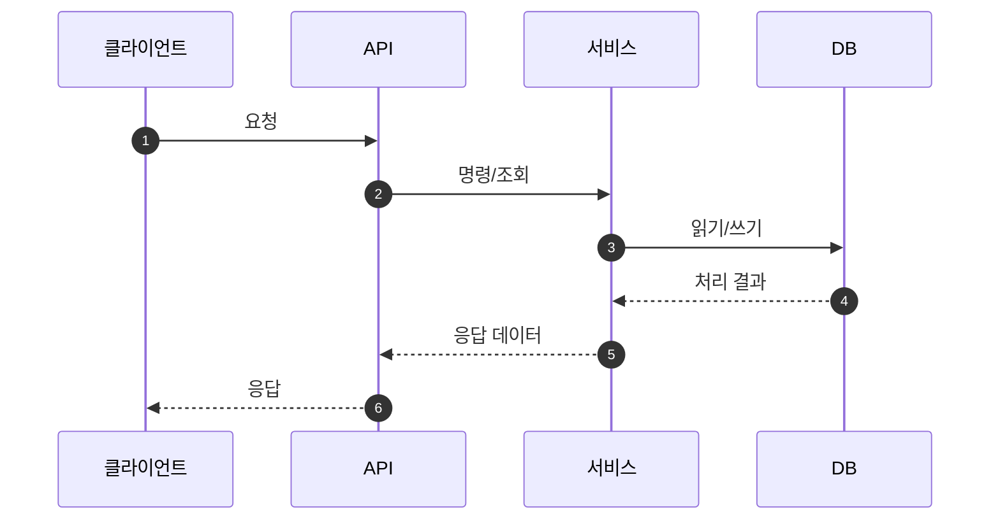

<!--
작성 규칙
- PR 제목은 영문으로 작성합니다.
- PR 본문은 아래 템플릿에 맞춰 한글로 작성합니다.
-->

## 📌 요약

<!--
무엇을 왜 변경했는지 한눈에 알 수 있도록 작성합니다.
- 배경(문제) / 목표 / 결과를 3~5줄로 정리합니다.
-->

- 배경:
- 목표:
- 결과:

## 🧭 배경 및 의사결정

<!--
주요 설계 결정과 판단 근거를 기록합니다.
핵심 질문은 "왜 이 방식으로 구현했는가?"입니다.
-->

### 문제 정의

- 기존 동작/제약사항:
- 문제 또는 위험:
- 완료 기준:

### 대안 및 최종 결정

- 검토한 대안:
  - 대안 A:
  - 대안 B:
- 최종 결정:
- 트레이드오프:
- 향후 개선사항:

## 🏗️ 설계 개요

<!--
변경된 구성요소와 각 책임을 간략히 정리합니다.
-->

### 변경 범위

- 영향받는 모듈/도메인:
- 새로 추가된 항목:
- 제거 또는 대체된 항목:

### 주요 구성요소별 책임

- `구성요소A`:
- `구성요소B`:
- `구성요소C`:

## 🔁 흐름도

<!--
가능하면 Mermaid를 사용합니다. 시퀀스 또는 플로우차트 중 적합한 형식을 선택합니다.
정상 흐름을 먼저 작성하고, 예외 흐름은 아래에 분리해 작성합니다.
-->

### 정상 흐름

